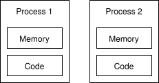
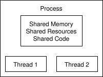

# C++ Fundamentals for Embedded Systems

## Introduction to C++

C++ is a compiled language that combines low-level memory management with high-level abstractions. In embedded systems and real-time control applications, C++ provides the performance and efficiency needed while maintaining code clarity and organization.

---

## Variables and Memory Management

A [variable](https://en.cppreference.com/book/intro/variables) is a location in memory that stores a value. In C++, when you declare a variable, the compiler allocates memory based on its type:

```cpp
int x = 10;          // Allocates 4 bytes (typically) for an integer
float temp = 25.3;   // Allocates 4 bytes for a floating-point number
bool flag = true;    // Allocates 1 byte for a boolean
```

**Memory Layout Example:**
```
Memory Address    |  Variable   |  Value
0x1000            |   x (int)   |   10
0x1004            |   temp      |  25.3
0x1008            |   flag      |  true
```

### Pointers: Direct Memory Access

A [pointer](https://en.cppreference.com/w/c/language/pointer.html) is a variable that stores a memory address. This is fundamental for advanced programming. You can use pointers to access specific locations in memory where variables are stored, and you can also use pointers to reference functions or objects.


**Using pointers in C++:**

```cpp
int x = 10;
int* ptr = &x;        // ptr points to x's address (&x is the address operator)

std::cout << *ptr;    // Dereference: prints 10
std::cout << ptr;     // Prints the memory address
*ptr = 20;            // Modify x through the pointer
```

**Pointer diagram:**
```
Variable x:    |  Memory Address 0x1000  |  Value: 10
Pointer ptr:   |  Memory Address 0x1008  |  Value: 0x1000 (points to x)
```

### Passing Variables to Functions

There are three ways to pass variables to [functions](https://en.cppreference.com/w/c/language/functions.html), each with different behavior:

#### Pass by Value (Copy)

When you pass a variable by value, the function receives a copy of the data. Changes made inside the function do not affect the original variable. Each function call creates a new copy. This is safe, but it costs memory for larger data structures.

**How it works:**
```cpp
void incrementByValue(int num) {
    num++;  // Only increments the copy
}

int x = 10;
incrementByValue(x);
// x is still 10 (unchanged)
```

#### Pass by Pointer

When you pass a pointer, you pass the address of the variable. The function can directly modify the original variable by dereferencing the pointer. Passing by pointer is efficient, but it requires careful pointer syntax.

**How it works:**
```cpp
void incrementByPointer(int* num) {
    (*num)++;  // Increments the value at the address
}

int x = 10;
incrementByPointer(&x);
// x is now 11 (modified through pointer)
```

#### Pass by Reference

Similar to pointers, references allow you to modify the original variable. However, references have cleaner syntax and cannot be null. References are the modern C++ way to pass variables for modification.

**How it works:**
```cpp
void incrementByReference(int& num) {
    num++;  // Modifies original with clean syntax
}

int x = 10;
incrementByReference(x);
// x is now 11 (modified through reference)
```

---

## Classes: Object-Oriented Programming

[Classes](https://en.cppreference.com/w/cpp/language/classes.html) organize code by bundling data and operations together. This is useful in embedded systems because it creates clear interfaces between components and keeps implementation details contained.

Modularity, encapsulation, reusability, and maintainability are the main benefits. Each hardware component can be represented as a class; internal details stay hidden, code can be reused across projects, and the resulting structure is easier to understand and modify.

### Basic Class Structure

```cpp
// Declaration (in .h file)
class Motor {
private:          // Hidden from outside
    int speed;
    
public:           // Accessible from outside
    Motor();      // Constructor
    ~Motor();     // Destructor
    
    void setSpeed(int newSpeed);
    int getSpeed() const;
};

// Implementation (in .cpp file)
Motor::Motor() {
    // constructor
    speed = 0;
}

Motor::~Motor() {
    // destructor
}

void Motor::setSpeed(int newSpeed) {
    if (newSpeed >= 0 && newSpeed <= 100) {
        speed = newSpeed;
    }
}

int Motor::getSpeed() const {
    return speed;
}
```

**Usage:**
```cpp
Motor motor;
motor.setSpeed(50);
std::cout << motor.getSpeed();  // Prints 50
```

### Constructors: Initialization

A [constructor](https://www.en.cppreference.com/w/cpp/language/initializer_list.html) initializes the object when it's created. It has the same name as the class and no return type.

```cpp
class Sensor {
private:
    float value;
    std::string name;
    
public:
    // Constructor
    Sensor(const std::string& sensorName) {
        name = sensorName;
        value = 0.0f;
    }
};

Sensor tempSensor("Temperature");  // Constructor called with argument
```

### Destructors: Cleanup

A [destructor](https://www.en.cppreference.com/w/cpp/language/destructor.html) is called when the object is destroyed and is used to clean up resources. You can identify it by the `~` before the class name.

```cpp
class DataBuffer {
private:
    int* data;
    int size;
    
public:
    DataBuffer(int bufferSize) {
        size = bufferSize;
        data = new int[size];  // Allocate memory
    }
    
    ~DataBuffer() {
        delete[] data;  // Release memory
    }
};
```

### Access Control: Private vs Public

```cpp
class PIDController {
private:
    // Only accessible within the class
    float Kp, Ki, Kd;
    float integral_sum;
    
    float calculateIntegral(float error);  // Helper method
    
public:
    // Accessible from outside
    PIDController(float p, float i, float d);
    
    float update(float error);
};
```

The distinction between private and public members allows you to hide class internals, prevent misuse, and expose only a controlled interface. Even if the internal implementation changes, users of the class are unaffected as long as the public interface remains stable.

---

## Header Files (.h) and Implementation Files (.cpp)

### Why Separate Files?

Dividing code into `.h` (header) and `.cpp` (implementation) files improves compilation efficiency because headers declare what exists while cpp files implement it. It also improves abstraction, modularity, and build organization, since users only see the interface and implementation changes do not force every dependent file to be rebuilt.

### Structure Example

**controller.h** (Declaration):
```cpp
#ifndef CONTROLLER_H
#define CONTROLLER_H

class PIDController {
private:
    float Kp, Ki, Kd;
    float previousError;
    float integralSum;
    
public:
    PIDController(float p, float i, float d);
    ~PIDController();
    
    float calculate(float error);
    void reset();
};

#endif
```

The `#ifndef` and `#define` include guard ensures that the header file content is processed only once per translation unit. Without include guards, multiple inclusions can cause redefinition errors.

**controller.cpp** (Implementation):
```cpp
#include "controller.h"

PIDController::PIDController(float p, float i, float d) {
    Kp = p;
    Ki = i;
    Kd = d;
    previousError = 0;
    integralSum = 0;
}

PIDController::~PIDController() {
    // Cleanup if needed
}

float PIDController::calculate(float error) {
    integralSum += error;
    float derivative = error - previousError;
    previousError = error;
    
    return Kp * error + Ki * integralSum + Kd * derivative;
}

void PIDController::reset() {
    previousError = 0;
    integralSum = 0;
}
```

---

## Threads vs Processes

### Why Concurrency Matters

Real-time control systems like the inverted pendulum need to read sensors continuously, update controllers at fixed intervals, send commands to actuators, and log data at the same time.

Without concurrency, if reading a sensor takes 100ms, you can't read another sensor or update the controller during that time.

### Processes: Isolated Programs

A **process** is a complete, independent program with its own memory space, resources, and isolation. Each process has completely separate memory and separate file handles or network connections.

The main advantages are stability and isolation. One crash does not bring down the whole system and bugs in one program do not directly affect another. The tradeoff is overhead because processes cannot directly access each other's memory, are slower to start and duplicate the program and its libraries in memory.



### Threads: Lightweight Concurrency

A [thread](https://en.cppreference.com/w/cpp/thread/thread.html) is a lightweight execution path within a single process. Multiple threads share the same memory space and resources, which makes them much faster to create than processes but also means they can access the same data directly.



#### The Race Condition Problem

When multiple threads access shared data simultaneously, unpredictable behavior occurs:

```cpp
int sensorValue = 0; // Shared data

// Thread 1 (Reader)
void readSensor() {
    sensorValue = getSensorReading();  // Reads from hardware
}

// Thread 2 (Controller)
void updateController() {
    int value = sensorValue;  // Uses the sensor value
}
```

If thread 1 changes `sensorValue` while thread 2 is reading it, the behavior is unpredictable. A partial write might be observed, which can corrupt the read value and may lead to unstable behavior or a crash. To prevent this, shared memory access must be synchronized.

Common synchronization mechanisms include a mutex, a lock guard, and a condition variable:

1. **Mutex (Mutual Exclusion)**: A [mutex](https://en.cppreference.com/w/cpp/thread/mutex.html) ensures that only one thread can access shared data at a time. If another thread already holds the lock, `lock()` blocks until the mutex becomes available.

```cpp
#include <mutex>

int sensorValue = 0;
std::mutex sensorMutex;  // Lock for protecting sensorValue

// Thread 1 (Reader)
void readSensor() {
    int reading = getSensorReading();
    
    sensorMutex.lock();      // Acquire lock
    sensorValue = reading;
    sensorMutex.unlock();    // Release lock
}

// Thread 2 (Controller)
void updateController() {
    sensorMutex.lock();      // Acquire lock
    int value = sensorValue;
    sensorMutex.unlock();    // Release lock
    
    // Use value safely
}
```

2. **Lock Guard**: [std::lock_guard](https://en.cppreference.com/w/cpp/thread/lock_guard.html) uses the same mutex mechanism, but manages lock lifetime automatically. The lock is acquired on construction and released automatically when the guard goes out of scope.

```cpp
void readSensor() {
    int reading = getSensorReading();
    
    {
        std::lock_guard<std::mutex> lock(sensorMutex);
        sensorValue = reading;
    }  // Lock automatically released here
}
```

3. **Condition Variable**: A [condition variable](https://en.cppreference.com/w/cpp/thread/condition_variable.html) allows one thread to signal other threads that are waiting for a specific event.

```cpp
#include <condition_variable>

std::mutex dataMutex;
std::condition_variable dataReady;
int sensorValue = 0;
bool newData = false;

// Thread 1 (Reader): Waits for new sensor data
void controller() {
    std::unique_lock<std::mutex> lock(dataMutex);
    
    dataReady.wait(lock, []{ return newData; });  // Wait until newData is true
    
    int value = sensorValue;  // Safe to use
    newData = false;
    lock.unlock();
}

// Thread 2 (Sensor): Signals when data is ready
void readSensor() {
    int reading = getSensorReading();
    
    {
        std::lock_guard<std::mutex> lock(dataMutex);
        sensorValue = reading;
        newData = true;
    }
    
    dataReady.notify_one();  // Wake up waiting thread
}
```

---

## Threads in C++: The Standard Library

### How to Create and Use Threads

C++ provides the `<thread>` header for creating threads:

```cpp
#include <thread>
#include <iostream>

void workerThread() {
    std::cout << "Thread is running!\n";
}

int main() {
    std::thread t(workerThread);  // Create and start thread
    t.join();                      // Wait for thread to finish
    
    std::cout << "Done\n";
    return 0;
}
```

You can also pass arguments to the created thread:

```cpp
#include <thread>

void printMessage(const std::string& msg, int count) {
    for (int i = 0; i < count; ++i) {
        std::cout << msg << "\n";
    }
}

int main() {
    std::thread t(printMessage, "Hello", 5);
    t.join();
    return 0;
}
```

---

## Build System: Compilation and CMake

Build systems handle compilation, linking, dependency tracking, and cross-platform build generation, so you only rebuild what changed and can reuse the same project description across operating systems. In practice, this means you describe your project structure once, and the tool orchestrates the steps needed to transform source code into a runnable program. For small projects, manual compiler commands may still work, but as soon as a project grows to multiple files, libraries, and platforms, a build system becomes essential for reliability and maintainability.

The compiler transforms source code through several stages. First, the preprocessor expands includes and macros. Then the compiler translates each translation unit into object code. Finally, the linker combines object files and external libraries into a single executable.

### CMake: Managing Complex Builds

CMake is a build system generator: instead of writing raw compiler commands for every file, you declare targets, source files, include paths, libraries, and compiler settings in `CMakeLists.txt`. CMake then generates native build files for your platform, which keeps the build process portable and easier to evolve as the codebase grows.

**CMakeLists.txt** (describes the project):
```cmake
cmake_minimum_required(VERSION 3.10)
project(PendulumController)

# Add source files
add_executable(controller
    src/main.cpp
    src/controller.cpp
    src/simulator.cpp
)

# Include directories for headers
target_include_directories(controller PRIVATE include)

# Link libraries if needed
target_link_libraries(controller PRIVATE pthread)

# Compiler options
target_compile_options(controller PRIVATE -Wall -Wextra -O2)
```

**How to build:**
```bash
mkdir build
cd build
cmake ..           # Generate platform-specific build files
make               # Actually compile and link
./controller       # Run the program
```

### Key CMake Concepts

The following CMake commands define how your program is built and what it depends on.

**Adding executables:**
```cmake
add_executable(program_name source1.cpp source2.cpp)
```

`add_executable(...)` creates a build target that produces a runnable program. You give the target name and list its source files; CMake then knows which files must be compiled and linked to create that executable.

**Linking libraries:**
```cmake
target_link_libraries(program_name PRIVATE library_name)
```

`target_link_libraries(...)` attaches libraries to a target so symbols used in your code can be resolved during linking. The `PRIVATE` keyword means this dependency is used internally by this target and is not propagated to targets that depend on it.

**Include paths:**
```cmake
target_include_directories(program_name PRIVATE include/)
```

`target_include_directories(...)` tells the compiler where to search for header files referenced with `#include`. Without the correct include paths, compilation fails with missing-header errors even if the files exist in the repository.

**Compiler flags:**
```cmake
target_compile_options(program_name PRIVATE -Wall -Wextra)
```

`target_compile_options(...)` sets compiler arguments for a target. Flags such as `-Wall` and `-Wextra` enable more warnings, helping you catch potential bugs early.

Taken together, these commands let you describe the executable, where its headers are, which libraries it needs, and how strictly it should be compiled. This modular approach makes it easy to add new source files, change compiler settings, link external libraries, and build on different platforms without rewriting your build workflow.